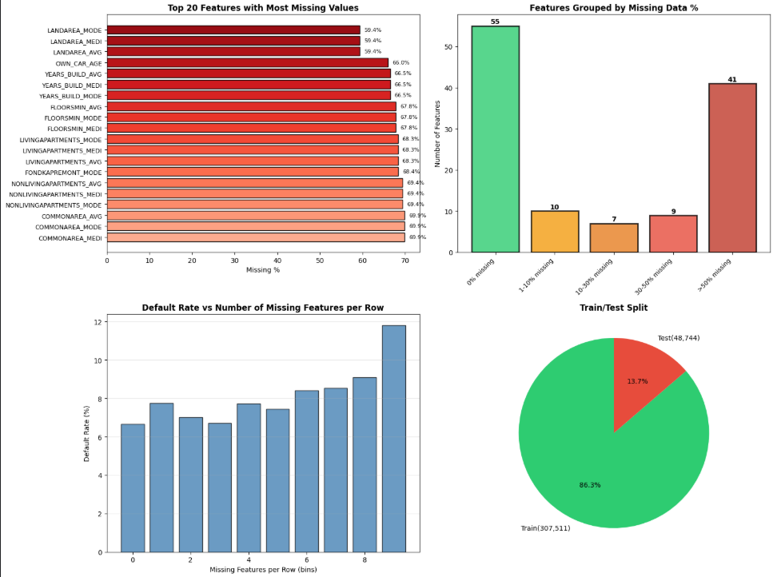
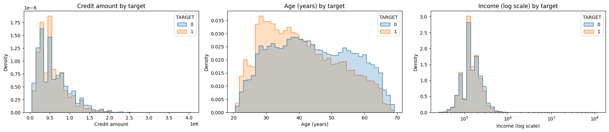
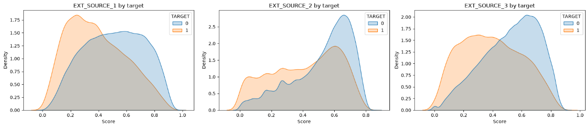
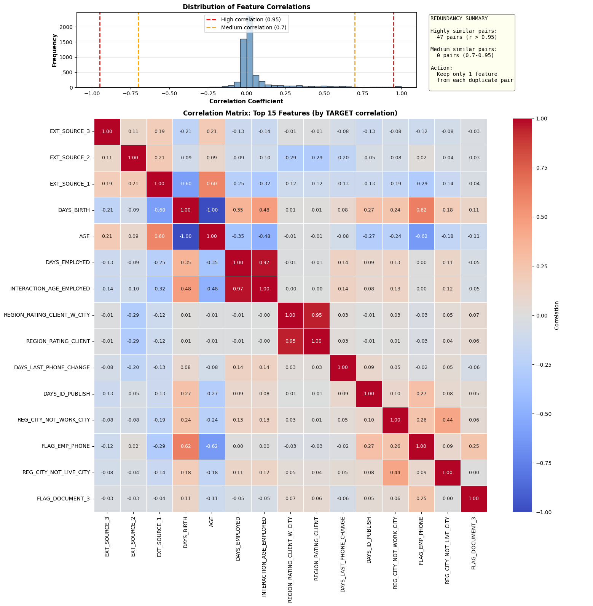
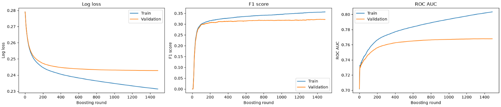
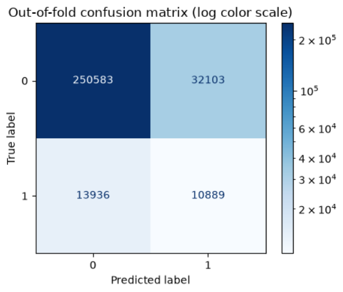
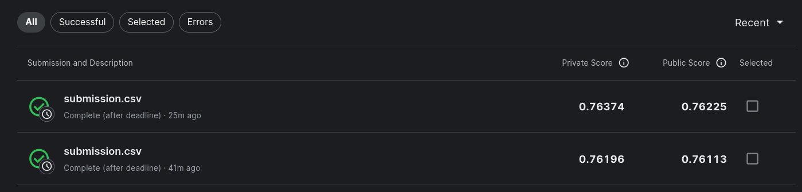
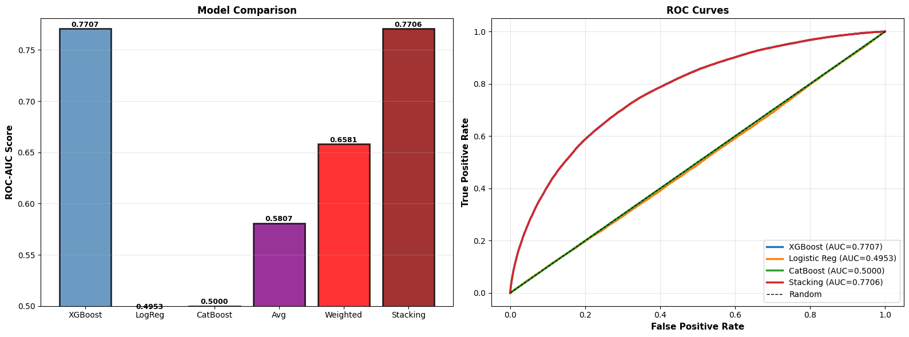
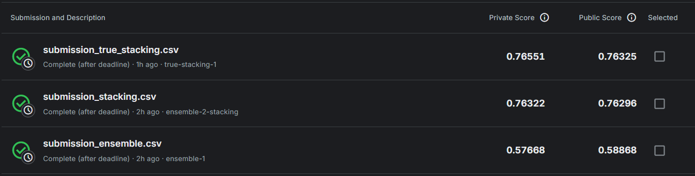

# Deep-Learning-Assignment-1

## Home Credit Default Risk - short summary

Kaggle competition: https://www.kaggle.com/competitions/home-credit-default-risk/

Goal: predict the probability of loan default (metric: ROC-AUC, with PR-AUC as a secondary metric because of class imbalance).

### Data

The models use three tables:

- `application_train/test`: the main application table, one row per loan. It gives the financial amounts, `EXT_SOURCE_*` scores, age, employment length and the client's categorical attributes.
- `bureau`: the client's loans at other banks. We derived debt relative to income, credit card limit utilization, the number of active and recent loans and the length of credit history.
- `POS_CASH_balance`: previous POS and cash loans at Home Credit. We derived how often and how recently the client paid late, and how much is left to pay on active loans.

These features are shared by the XGBoost pipeline, stacking, adversarial validation and DL Model4. DL Models 1-3 use only numeric columns from `application`. `bureau_balance` and `previous_application` were explored in EDA but not used in the models.

### application_train overview

- Train: 307,511 rows × 122 columns, Test: 48,744 × 121.
- The target is heavily imbalanced: **8.07% defaults** vs 91.93% non-defaults.
- Column types: 65 float64, 41 int64, 16 object (categorical).

### Missing and invalid values

- 67 of 122 columns have missing values, about 23-24% of all cells. 41 features are more than 50% missing (mostly housing characteristics: `COMMONAREA_*`, `NONLIVINGAPARTMENTS_*`, `LIVINGAPARTMENTS_*` with ~68-70% NaN).
- `DAYS_EMPLOYED` contains the placeholder value **365243** instead of real employment length. It is clearly a code for "unemployed/pensioner", not a missing value; after replacing it with NaN the distribution looks reasonable.
- Categorical columns use `XNA` as a hidden missing value: `CODE_GENDER` (4 rows), `ORGANIZATION_TYPE` (55,374 rows).
- The missing-value pattern is almost identical in train and test (difference below 1.5 points for every column), which is a good sign of no data leakage.

### Distributions and relation to the target

- Younger clients default more often: **12.3%** in the 18-25 group vs **3.7%** for 65+. Age is one of the strongest predictors.
- Income and credit amount have long right tails (the lognormal shape typical for money amounts). Younger and defaulting borrowers more often take smaller loans.
- `EXT_SOURCE_1/2/3` (external credit scores) have the strongest absolute correlation with the target (-0.16 to -0.18), and their densities differ clearly between classes 0 and 1.
- IQR analysis flags many "outliers" in binary and rating columns (`REGION_RATING_CLIENT`, `FLAG_*`). This is an artifact of the method on discrete variables, not real anomalies.

In all three external scores, defaulters sit lower. For `EXT_SOURCE_1` and `EXT_SOURCE_3` the defaulter density peaks around 0.2-0.3, while non-defaulters peak around 0.6-0.65, and the curves cross near 0.4-0.45. `EXT_SOURCE_2` is skewed left for both classes, with a shared peak near 0.6, but defaulters have a much thicker tail below 0.4. The classes still overlap a lot, so no single score separates them on its own. That is why the model combines all three with other features.

### Feature redundancy (multicollinearity)

- There are **47 feature pairs with r > 0.95**, effectively duplicates (for example `AMT_CREDIT` <-> `AMT_GOODS_PRICE`: 0.987, `DAYS_BIRTH` <-> `AGE`: -1.0, and the three `_AVG/_MODE/_MEDI` groups for the same housing characteristic). It makes sense to keep one feature from each pair, although with a good reason both can stay.
- `bureau` data (credit history) adds signal: clients with overdue payments (`HAS_DELINQUENCY`) default more often (15.9% vs 8.0%), but the raw count of previous loans barely correlates with the target (-0.01).
- About 14% of clients have no `bureau` history, and they default more often: 10.1% vs 7.7%. So the absence of history also became a feature (`HAS_BUREAU`).

## Validation

### Adversarial validation

There was done Adversarial validation between the transformed train and transformed test set. Those transformations are can be seen in ml.ipynb, like feature engineering and handling missing values. 

So mainly, there are some key drivers for train/test mismatch "categorical__NAME_CONTRACT_TYPE_Cash loans" column, financial scale features (AMT_ANNUITY, AMT_CREDIT, AMT_GOODS_PRICE), external scores and temporal Features (EXT_SOURCE_1, YEARS_SINCE_ID_PUBLISH, BUREAU_DAYS_SINCE_LAST_LOAN). That shift distribution can explain why the difficulty of competition and why the maximum ROC AUC is near 0.8. 

### Deep learning validation

Validation evaluation was done by calculating ROC AUC for validation set that were get by stratified split 80% / 20%. As I wrote above the test has other distribution and it is different from our validation(train) distribution that's why we get pretty optimistic evaluation

Kaggle private score / local validation

Model1: 0.71661 / 0.732

Model2: 0.72407 / 0.738

Model3: 0.72489 / 0.739

Model4: 0.74725 / 0.756

Each model is described Deep learning model section.

## Machine Learning Model

XGBoost with stratified 5-fold CV. The Kaggle prediction is the mean of the five fold models.

To limit overfitting, the trees are kept shallow (`max_depth=4`) and regularized with `min_child_weight`, `reg_lambda` (L2) and `gamma`, plus row and column subsampling. The eval metric is ROC-AUC (`eval_metric='auc'`), and early stopping ends training once validation AUC has not improved for 100 rounds, so each fold keeps its best iteration (1387-1977 trees out of the 3000 allowed).

### Settings

| Parameter | Value |
|-----------|-------|
| n_estimators / early stopping | 3000 / 100 rounds on val AUC |
| max_depth / learning_rate | 4 / 0.03 |
| min_child_weight / reg_lambda / gamma | 50 / 5 / 1 |
| subsample / colsample_bytree | 0.8 / 0.5 |

### Training

Log loss, F1 and ROC-AUC per boosting round on fold 1. Validation metrics flatten after about 400-600 rounds, while the train curves keep improving, so the later trees mostly fit the training data. Early stopping cuts training at the validation AUC plateau.

Out-of-fold predictions at the threshold that maximizes F1 (0.151). The model catches 10,889 of 24,825 defaulters (recall 0.44), and about one in four flagged clients actually defaults (precision 0.25). The cost is 32,103 good clients flagged as risky.

### Results

| Metric | Train | Validation |
|--------|-------|------------|
| ROC-AUC | 0.808 | 0.771 ± 0.004 |
| PR-AUC | 0.322 | 0.260 ± 0.007 (baseline 0.081) |
| F1 | 0.363 | 0.322 ± 0.008 |

On Kaggle: **0.76374** private / 0.76225 public.

### Feature importance

Top 10 features by XGBoost gain importance, averaged over the five fold models. Descriptions of raw columns come from `HomeCredit_columns_description.csv`; engineered features are described from the notebook code.

| Rank | Feature | Gain | Description |
|------|---------|------|-------------|
| 1 | `EXT_SOURCE_2` | 0.074 | Normalized score from external data source |
| 2 | `HAS_BUREAU` | 0.070 | Engineered: 1 if the client has any loans in `bureau` |
| 3 | `EXT_SOURCE_3` | 0.067 | Normalized score from external data source |
| 4 | `NAME_EDUCATION_TYPE` = Higher education | 0.048 | Level of highest education the client achieved |
| 5 | `NAME_INCOME_TYPE` = Working | 0.033 | Client's income type (businessman, working, maternity leave, ...) |
| 6 | `DOCUMENT_FLAG_SCORE` | 0.029 | Engineered: share of `FLAG_DOCUMENT_2..21` the client provided |
| 7 | `EXT_SOURCE_1` | 0.026 | Normalized score from external data source |
| 8 | `NAME_EDUCATION_TYPE` = Secondary / secondary special | 0.025 | Level of highest education the client achieved |
| 9 | `POS_MONTHS_SINCE_DPD` | 0.020 | Engineered: months since the last late payment (`SK_DPD_DEF` > 0) on POS/cash loans, 999 if never late |
| 10 | `DAYS_EMPLOYED_ANOM` | 0.019 | Engineered: 1 if `DAYS_EMPLOYED` holds the 365243 placeholder |

All three external scores are in the top 10. Four of the ten are engineered features, and two of them are built from the auxiliary tables (`HAS_BUREAU`, `POS_MONTHS_SINCE_DPD`).

## Deep Learning Model

### Architecture

The model is a deep MLP designed for tabular binary classification,
built with custom PyTorch components and trained via PyTorch Lightning.

Input features (104/123) pass through a `FeatureGatingLayer` first, which
applies a learned sigmoid gate per feature — allowing the model to
suppress irrelevant inputs before any linear transformation. This is
followed by four blocks of `MyLinearLayer → MyBatchNorm → LeakyReLU → 
Dropout`, progressively reducing dimensionality from 104 → 52 → 26 → 
13 → 6, before a final `Linear(6 → 1)` output layer.

**Activation:** LeakyReLU(0.1) was chosen over ReLU to avoid zero 
gradients on negative inputs (dying neuron problem).

**Regularization:** Dropout(0.2) was applied after each block to 
reduce overfitting, alongside BatchNorm for training stability and 
gradient clipping (max_norm=1.0) to prevent exploding gradients.

**Layer sizes** follow a progressive halving strategy (104→52→26→13→6),
gradually compressing the feature space into a compact representation
before the final prediction.

---

### Custom Components

| Component | Type | Key Detail |
|-----------|------|------------|
| `MyLinearLayer` | Reimplementation | Default PyTorch weight initialization |
| `FeatureGatingLayer` | Original | LeCun init, sigmoid gate |
| `MyBatchNorm` | Reimplementation | Manual running stats |
| `MyAdam` | Optimizer | 1st/2nd moment + bias correction |

---

### Training Configuration

| Setting | Value |
|---------|-------|
| Loss | BCEWithLogitsLoss |
| Optimizer | MyAdam (lr=1e-3) |
| Scheduler | CosineAnnealingLR (T_max=10) |
| Batch size | 1024 |
| Early stopping | patience=5, monitor=val_auroc |
| Gradient clipping | max_norm=1.0 |

---

### Results

Four models were trained with progressive improvements:

| Model | Local Val AUROC | Kaggle Private AUC |
|-------|-----------------|--------------------|
| Model 1 | 0.732 | 0.71661 |
| Model 2 | 0.738 | 0.72407 |
| Model 3 | 0.739 | 0.72489 |
| Model 4 | 0.756 | 0.74725 |

model1 - only numeric data from train.csv 10 epoches
model2 - only numeric data from train.csv, added one layer(to model1) and changed dropout to 0.3
model3 - only numeric data from train.csv, added one layer(to model1) and changed dropout to 0.1
model4 - transformed training df and test df used from ml pipeline, added one layer(to model1) and changed dropout to 0.1

Here you can see all charts with metrics: https://wandb.ai/ilukianets-kyiv-school-of-economics/Deep%20learning%20assignment%201/workspace?nw=nwuserilukianets

---

### Conclusion

The best model achieved a local validation AUROC of **0.756** and a 
Kaggle private score of **0.747**, compared to the XGBoost baseline Kaggle
private score of **0.76374**. The neural network performs reasonably well but does not 
yet surpass the tree-based baseline, which is a common finding on 
tabular datasets where gradient boosting tends to dominate.

The gap between local validation (0.756) and Kaggle private score (0.747)
suggests mild overfitting to the validation set. A natural next step
would be adding more layers and depth to the network, alongside
stronger regularization and additional feature engineering from the
remaining auxiliary tables (credit card balances, installment payments).

### Ensembling

### Models: XGBoost + CatBoost + LogisticRegression (ensemble)

- **XGBoost** (5-fold CV, with the full preprocessing pipeline inside an sklearn `Pipeline`) is the only model that actually learned: OOF ROC-AUC = **0.761**.
- **Logistic Regression** and **CatBoost** in Part 2 receive the raw `X_train_val` without encoding the categorical columns. Both failed with `could not convert string to float: 'Cash loans'`, and the code silently replaces them with a stub (LR gives random numbers, CatBoost a constant 0.5 for every fold). The formal AUC of CatBoost is **0.5000** (pure random) and of LogReg **0.4953**, so neither predicts anything, and the failure is hidden by try/except.
- Because of this, **Simple Average (0.581)** and **Weighted Average (0.658)** are much worse than XGBoost alone, since they average the useful signal with two noise sources. **Stacking (0.765)** holds up only because the meta-model (logistic regression on OOF predictions) learned to ignore the LR/CatBoost noise columns and essentially copies XGBoost, occasionally drawing on the other models.
- Conclusion: the "three-model ensemble" is *de facto* a single XGBoost. For LR/CatBoost to contribute, they need to go through the same `ColumnTransformer` (one-hot/impute) as XGBoost, or CatBoost needs `cat_features` passed explicitly.

## Basic ensemble results on Kaggle

- The first attempt checked whether soft voting works even with badly configured CatBoost and LR. It did not.
- The second idea was to see what score a plain or slightly modified XGBoost gets, i.e. the baseline. Result: 0.763.
- The third attempt was real stacking. With badly configured components it was clearly not going to beat plain XGBoost by much, but it still gave something: 0.765.

## Soft voting

Soft voting of xgboost from ml.ipynb and deep learning model from featured-engineered-dl-model.ipynb got such result on Kaggle:

Basically, it was done by finding the mean of two predictions files that xgboost and deep learning models made. From ensemble perspective that's a soft voting with 0.5 trust coefficients. In the end, we got something in the middle between xgboost score and deep learning model

## Conclusion

XGBoost is the best single model in the project: 0.764 private score on Kaggle vs 0.747 for the best neural network. It overfits mildly (train AUC 0.808 vs validation 0.771), but the results are stable across folds. The Kaggle score is lower than CV because of the train/test distribution shift found by adversarial validation.

### Files

- `basic-data-exploration-dl.ipynb` - EDA: missing values, outliers, correlations, multi-table analysis.
- `ml.ipynb` - XGBoost on `application` + `bureau` + `POS_CASH_balance`, 5-fold CV, Kaggle submission.
- `deep-learning-assignment-basic-stacking.ipynb` - XGBoost pipeline + CatBoost/LogReg attempt + ensembling (Part 1-3).
- `Adversarial_validation.ipynb` - Adversarial validation on transformed data
- `deep-learning-model.ipynb` - The first deep learning model
- `featured-engineered-dl-model.ipynb` - Model4 from deep learning section

### AI-usage links:
Mykola Utkin: https://docs.google.com/document/d/1ZLfL9IkIUjAuPmhv_6ddnlLEch66RpQDP84bpFKz8WQ/edit?usp=sharing - I dont know how to normally share gemini chat history

Ivan Lukianets: Claude: https://claude.ai/share/3ff87479-d791-4b32-942b-82aedd1bb1ee Gemini: https://share.gemini.google/UBYvQmA6LngH

Taras Baraniuk: Claude Code (CLI)
